<h2>TensorFlow-FlexUNet-Image-Segmentation-NeurIPS2022-DIC-Weak-Boundary (2025/09/07)</h2>

This is the first experiment of Image Segmentation for NeurIPS2022 DIC Weak Boundary,
 based on our 
 <a href="https://github.com/sarah-antillia/TensorFlow-FlexUNet-Image-Segmentation-Model">
<b>TensorFlowFlexUNet (TensorFlow Flexible UNet Image Segmentation Model for Multiclass)</b></a> and a 512x512 pixels 
<a href="https://drive.google.com/file/d/1Rv_yI0Rq6TsT26ZyJCHMlOHngEDLE09h/view?usp=sharing">
Augmented-DIC-Weak-Boundary-ImageMask-Dataset.zip</a>.
which was derived by us using <a href="https://github.com/sarah-antillia/ImageMask-Dataset-Offline-Augmentation-Tool">
ImageMask-Dataset-Offline-Augmentation-Tool</a> 
from 120 
DIC (Differential Interference Contrast) Weak Boundary tif image files and corresponding label files in
Training-labeled dataset in <a href="https://zenodo.org/records/10719375">NeurIPS 2022 CellSegmentation</a>.
 
 On detail of DIC, please refer to <a href="https://www.olympus-lifescience.com/ja/microscope-resource/primer/techniques/dic/dicintro/">
Fundamental Concepts in DIC Microscopy</a> 
 
 
Please see also our singleclass segmentation model 
<a href="https://github.com/sarah-antillia/Tensorflow-Tiled-Image-Segmentation-Augmented-NeurIPS-DIC-Weak-Boundary">
Tensorflow-Tiled-Image-Segmentation-Augmented-NeurIPS-DIC-Weak-Boundary
</a>
 
 
As demonstrated in <a href="https://github.com/sarah-antillia/TensorFlow-FlexUNet-Image-Segmentation-STARE-Retinal-Vessel">
TensorFlow-FlexUNet-Image-Segmentation-STARE-Retinal-Vessel</a> ,
 our Multiclass TensorFlowFlexUNet, which uses categorized masks, can also be applied to 
single-class image segmentation models. 
This is because it inherently treats the background as one category and your single-class mask data as 
a second category. In essence, your single-class segmentation model will operate with two categorized classes within our Multiclass UNet framework.
 
 
<b>Acutual Image Segmentation for 512x512 DIC-Weak-Boundary images</b> 

As shown below, the inferred masks predicted by our segmentation model trained on the 
PNG dataset appear similar to the ground truth masks, 
 
 
<table>
<tr>
<th>Input: image</th>
<th>Mask (ground_truth)</th>
<th>Prediction: inferred_mask</th>
</tr>
<tr>
<td>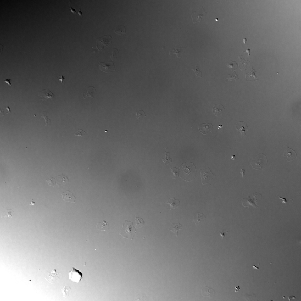</td>
<td>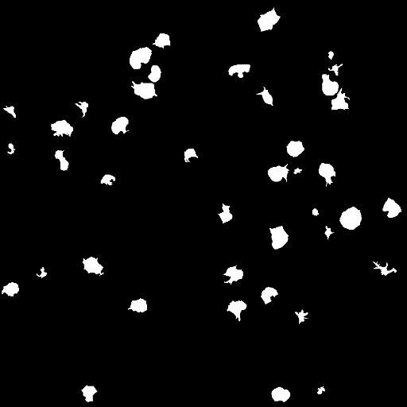</td>
<td></td>
</tr>
<tr>
<td>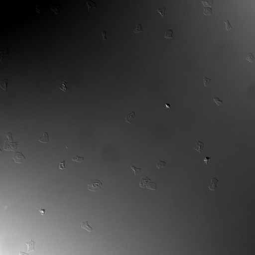</td>
<td></td>
<td></td>
</tr>
<tr>
<td>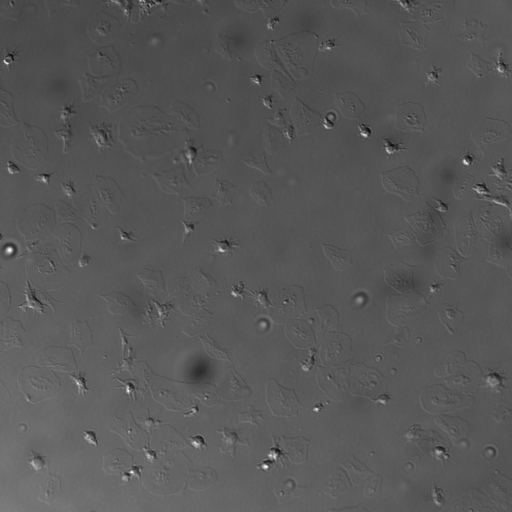</td>
<td>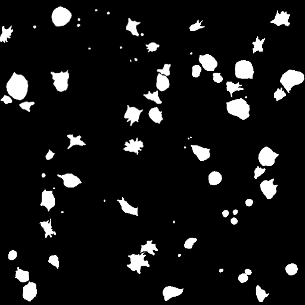</td>
<td></td>
</tr>
</table>

 
<h3>1. Dataset Citation</h3>
The dataset used here has been taken from the web-site: 
<a href="https://neurips22-cellseg.grand-challenge.org/dataset/"><b>Weakly Supervised Cell Segmentation in Multi-modality 
High-Resolution Miscroscopy Images</b>
</a>
  
<b>Download dataset</b> 
You can download a training dataset corresponding to the cell segmentation from the zendo.org website:  
<a href="https://zenodo.org/records/10719375/files/Training-labeled.zip?download=1">Training-labeled.zip
</a> 
 
<b>NeurIPS 2022 Cell Segmentation Competition Dataset</b> 
Ma, Jun, Xie, Ronald, Ayyadhury, Shamini, Ge, Chen, Gupta, Anubha, Gupta, Ritu, Gu, Song,  
Zhang, Yao, Lee, Gihun, Kim, Joonkee, Lou, Wei, Li, Haofeng, Upschulte, Eric, Dickscheid, Timo, 
de Almeida, José Guilherme, Wang, Yixin, Han, Lin,Yang, Xin, Labagnara, Marco,Gligorovski, Vojislav, 
Scheder, Maxime, Rahi, Sahand Jamal,Kempster, Carly, Pollitt, Alice, Espinosa, Leon, Mignot, Tam, 
Middeke, Jan Moritz, Eckardt, Jan-Niklas, Li, Wangkai, Li, Zhaoyang, Cai, Xiaochen, Bai, Bizhe, 
Greenwald, Noah F., Van Valen, David, Weisbart, Erin, Cimini, Beth A, Cheung, Trevor, Brück, Oscar, 
Bader, Gary D.,Wang, Bo 

Zenodo. https://doi.org/10.5281/zenodo.10719375 
  
Please cite the following paper if this dataset is used in your research.  
<pre style="font-size: 16px">
@article{NeurIPS-CellSeg,
      title = {The Multi-modality Cell Segmentation Challenge: Towards Universal Solutions},
      author = {Jun Ma and Ronald Xie and Shamini Ayyadhury and Cheng Ge and Anubha Gupta and Ritu Gupta 
      and Song Gu and Yao Zhang and Gihun Lee and Joonkee Kim and Wei Lou and Haofeng Li and Eric Upschulte 
      and Timo Dickscheid and José Guilherme de Almeida and Yixin Wang and Lin Han and Xin Yang and 
       Marco Labagnara and Vojislav Gligorovski and Maxime Scheder and Sahand Jamal Rahi and Carly Kempster
        and Alice Pollitt and Leon Espinosa and Tâm Mignot and Jan Moritz Middeke and Jan-Niklas Eckardt 
        and Wangkai Li and Zhaoyang Li and Xiaochen Cai and Bizhe Bai and Noah F. Greenwald and David Van Valen 
        and Erin Weisbart and Beth A. Cimini and Trevor Cheung and Oscar Brück and Gary D. Bader and Bo Wang},
      journal = {Nature Methods},
      volume={21},
      pages={1103–1113},
      year = {2024},
      doi = {https://doi.org/10.1038/s41592-024-02233-6}
  }
</pre>  
 
 
<b>Data license</b>: CC BY-NC-ND
 
 
<h3>
2 DIC-Weak-Boundary ImageMask Dataset
</h3>
 If you would like to train this DIC-Weak-Boundary Segmentation model by yourself,
 please download the dataset from the google drive  
<a href="https://drive.google.com/file/d/1Rv_yI0Rq6TsT26ZyJCHMlOHngEDLE09h/view?usp=sharing">
Augmented-DIC-Weak-Boundary-ImageMask-Dataset.zip</a>.
 
, expand the downloaded ImageMaskDataset and put it under <b>./dataset</b> folder to be
<pre>
./dataset
└─DIC-Weak-Boundary
    ├─test
    │   ├─images
    │   └─masks
    ├─train
    │   ├─images
    │   └─masks
    └─valid
        ├─images
        └─masks
</pre>
 
<b>DIC-Weak-Boundary Statistics</b> 
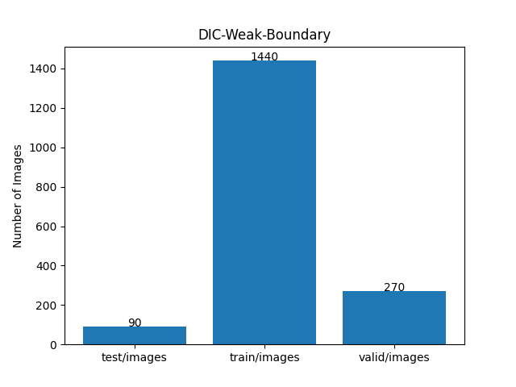 
 
<!--
On the derivation of the dataset, please refer to the following Python scripts: 
<li><a href="./generator/ImageMaskDatasetGenerator.py">ImageMaskDatasetGenerator.py</a></li>
<li><a href="./generator/split_master.py">split_master.py</a></li>
 
-->
As shown above, the number of images of train and valid datasets is not so large to use for a training set of our segmentation model.
 
 
<b>Train_images_sample</b> 
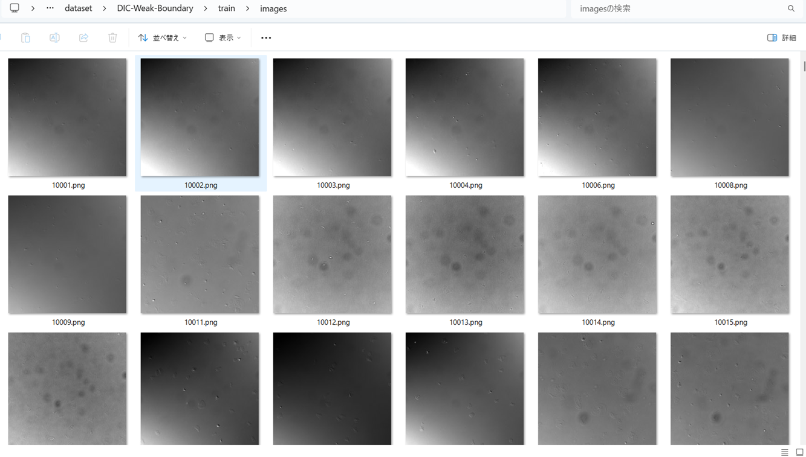
 
<b>Train_masks_sample</b> 
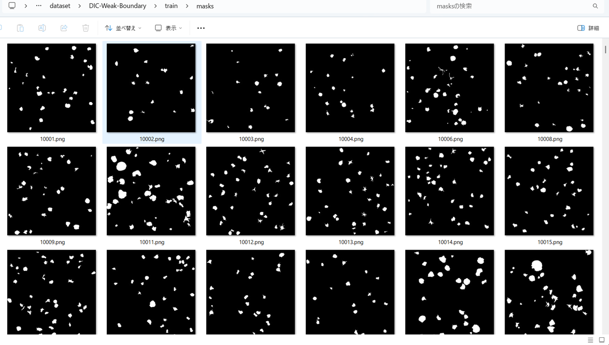
 
<h3>
3 Train TensorFlowFlexUNet Model
</h3>
 We trained DIC-Weak-Boundary TensorFlowFlexUNet Model by using the following
<a href="./projects/TensorFlowFlexUNet/DIC-Weak-Boundary/train_eval_infer.config"> <b>train_eval_infer.config</b></a> file.  
Please move to ./projects/TensorFlowFlexUNet/DIC-Weak-Boundary and run the following bat file. 
<pre>
>1.train.bat
</pre>
, which simply runs the following command. 
<pre>
>python ../../../src/TensorFlowFlexUNetTrainer.py ./train_eval_infer.config
</pre>

<b>Model parameters</b> 
Defined a small <b>base_filters = 16 </b> and large <b>base_kernels = (9,9)</b> for the first Conv Layer of Encoder Block of 
<a href="./src/TensorFlowFlexUNet.py">TensorFlowFlexUNet.py</a> 
and a large num_layers (including a bridge between Encoder and Decoder Blocks).
<pre>
[model]
;You may specify your own UNet class derived from our TensorFlowFlexModel
model         = "TensorFlowFlexUNet"
generator     =  False
image_width    = 512
image_height   = 512
image_channels = 3
num_classes    = 2

base_filters   = 16
base_kernels   = (9,9)
num_layers     = 8
dropout_rate   = 0.03
dilation       = (1,1)
</pre>
<b>Learning rate</b> 
Defined a very small learning rate.  
<pre>
[model]
learning_rate  = 0.00007
</pre>
<b>Loss and metrics functions</b> 
Specified "categorical_crossentropy" and <a href="./src/dice_coef_multiclass.py">"dice_coef_multiclass"</a>. 
<pre>
[model]
loss           = "categorical_crossentropy"
metrics        = ["dice_coef_multiclass"]
</pre>
<b>Dataset class</b> 
Specifed <a href="./src/ImageCategorizedMaskDataset.py">ImageCategorizedMaskDataset</a> class. 
<pre>
[dataset]
class_name    = "ImageCategorizedMaskDataset"
</pre>
 
<b>Learning rate reducer callback</b> 
Enabled learing_rate_reducer callback, and a small reducer_patience.
<pre> 
[train]
learning_rate_reducer = True
reducer_factor     = 0.3
reducer_patience   = 4
</pre>
<b>Early stopping callback</b> 
Enabled early stopping callback with patience parameter.
<pre>
[train]
patience      = 10
</pre>

<b>RGB Color map</b> 
rgb color map dict for DIC-Weak-Boundary 1+1 classes. 
<pre>
[mask]
mask_file_format = ".png"
; 1+1 classes
; RGB colors  DIC-Weak-Boundary:white     
rgb_map = {(0,0,0):0,(255,255,255):1,}
</pre>

<b>Epoch change inference callback</b> 
Enabled <a href="./src/EpochChangeInfereuncer.py">epoch_change_infer callback</a></b>. 
<pre>
[train]
epoch_change_infer       = True
epoch_change_infer_dir   =  "./epoch_change_infer"
num_infer_images         = 6
</pre>

By using this callback, on every epoch_change, the inference procedure can be called
 for 6 images in <b>mini_test</b> folder. This will help you confirm how the predicted mask changes 
 at each epoch during your training process.    

<b>Epoch_change_inference output at starting (epoch 1,2,3)</b> 
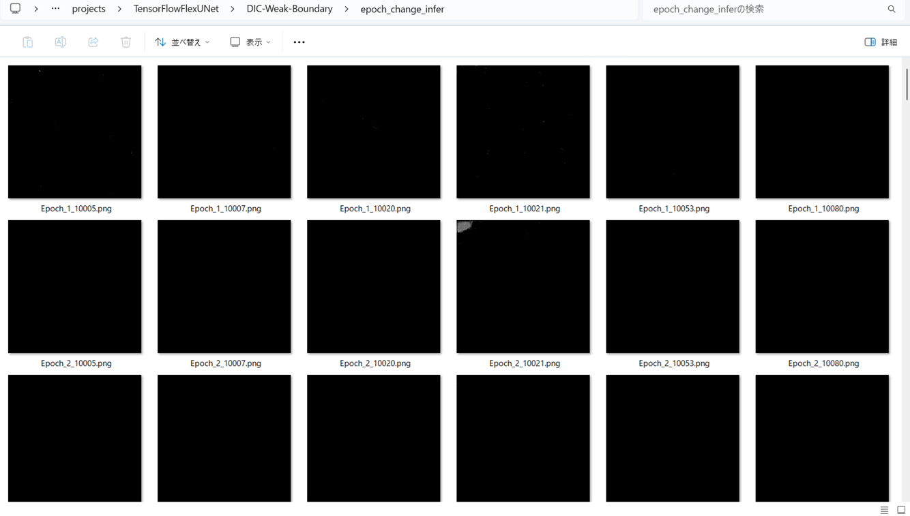 
 
<b>Epoch_change_inference output at middlepoint (epoch 17,18,19)</b> 
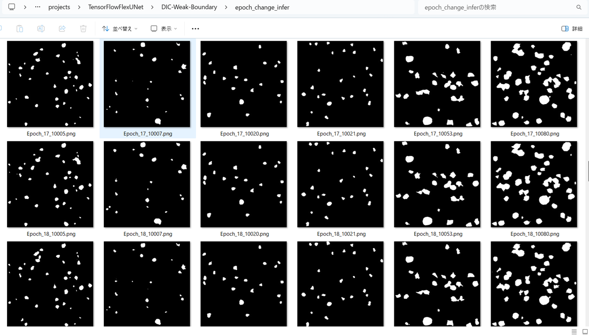 
 
<b>Epoch_change_inference output at ending (epoch 36,37,38)</b> 
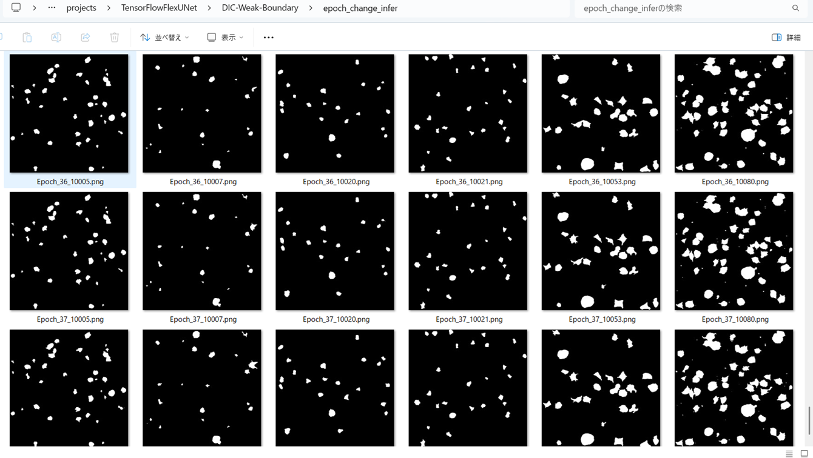 
 
In this experiment, the training process was stopped at epoch 38 by EarlyStoppingCallback.  
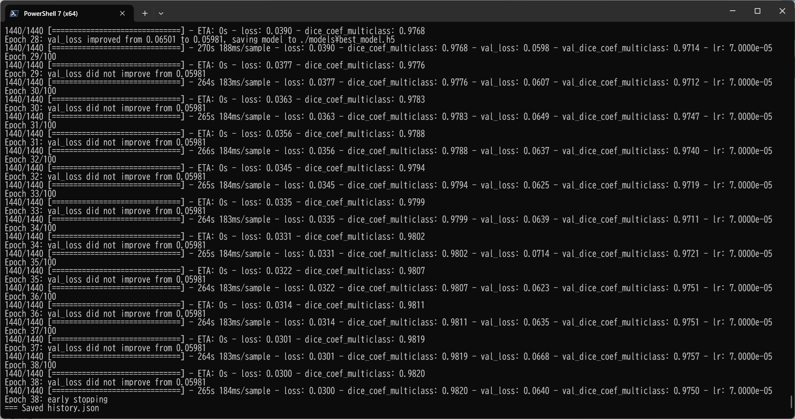 
 

<a href="./projects/TensorFlowFlexUNet/DIC-Weak-Boundary/eval/train_metrics.csv">train_metrics.csv</a> 
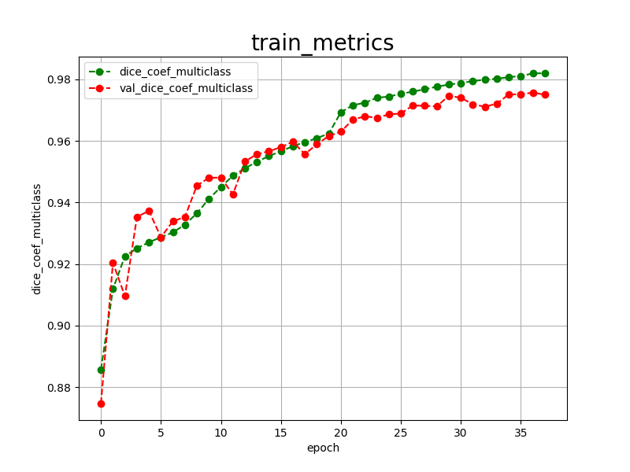 

 
<a href="./projects/TensorFlowFlexUNet/DIC-Weak-Boundary/eval/train_losses.csv">train_losses.csv</a> 
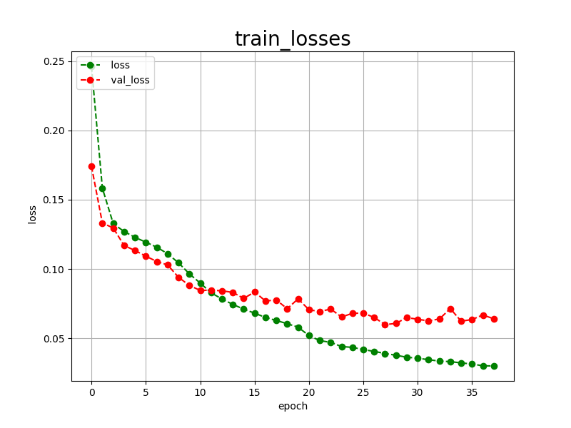 

 

<h3>
4 Evaluation
</h3>
Please move to <b>./projects/TensorFlowFlexUNet/DIC-Weak-Boundary</b> folder, 
and run the following bat file to evaluate TensorFlowFlexUNet model for DIC-Weak-Boundary. 
<pre>
./2.evaluate.bat
</pre>
This bat file simply runs the following command.
<pre>
python ../../../src/TensorFlowFlexUNetEvaluator.py ./train_eval_infer_aug.config
</pre>

Evaluation console output: 
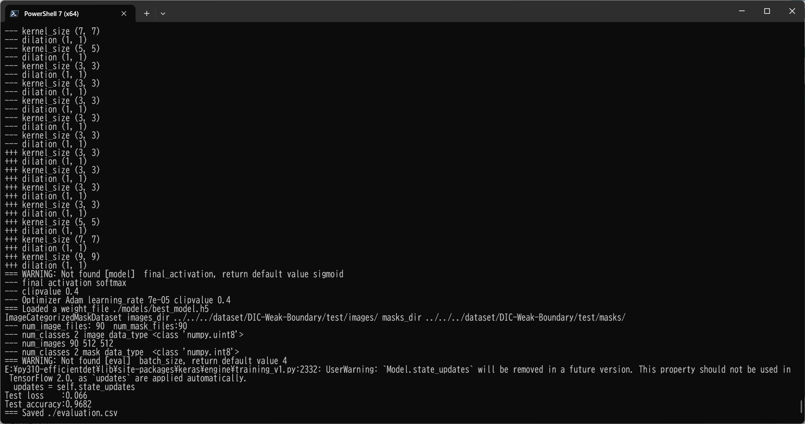
  

<a href="./projects/TensorFlowFlexUNet/DIC-Weak-Boundary/evaluation.csv">evaluation.csv</a> 
The loss (categorical_crossentropy) to this DIC-Weak-Boundary/test was low and dice_coef_multiclass 
high as shown below.
 
<pre>
categorical_crossentropy,0.066
dice_coef_multiclass,0.9682
</pre>
 

<h3>
5 Inference
</h3>
Please move <b>./projects/TensorFlowFlexUNet/DIC-Weak-Boundary</b> folder 
,and run the following bat file to infer segmentation regions for images by the Trained-TensorFlowFlexUNet model for DIC-Weak-Boundary. 
<pre>
./3.infer.bat
</pre>
This simply runs the following command.
<pre>
python ../../../src/TensorFlowFlexUNetInferencer.py ./train_eval_infer_aug.config
</pre>

<b>mini_test_images</b> 
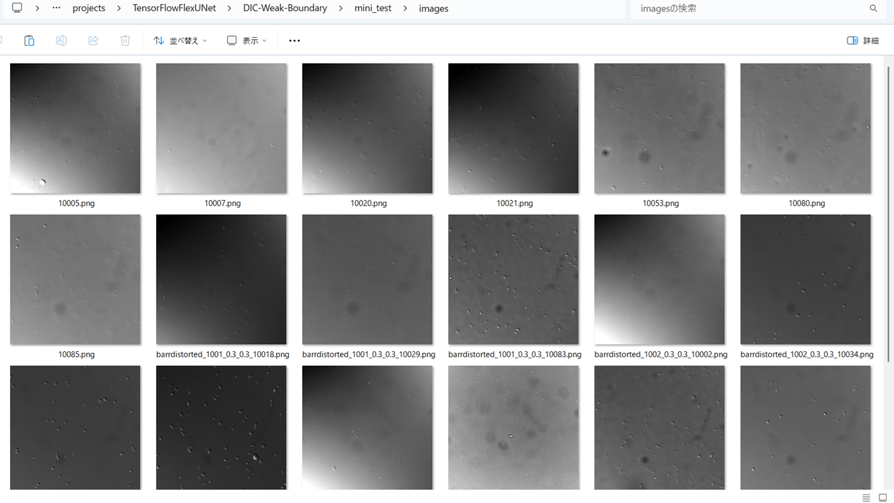 
<b>mini_test_mask(ground_truth)</b> 
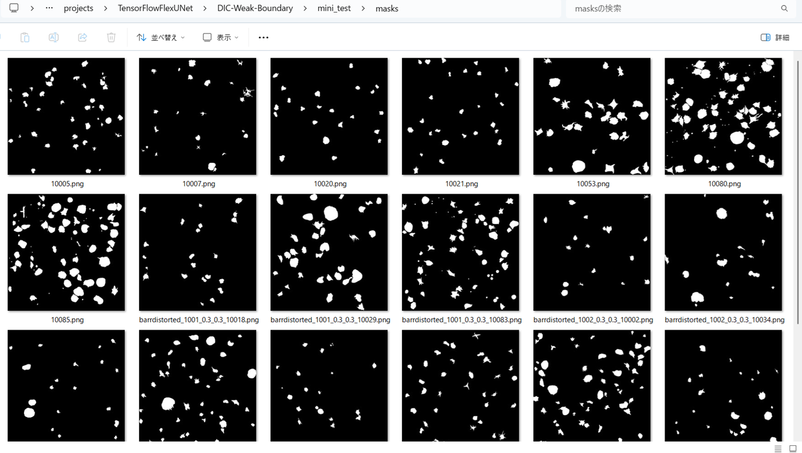 

<b>Inferred test masks</b> 
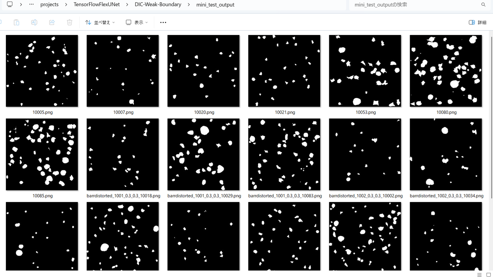 
 

<b>Enlarged images and masks of 512x512 pixels</b> 
<table>
<tr>
<th>Image</th>
<th>Mask (ground_truth)</th>
<th>Inferred-mask</th>
</tr>

<tr>
<td>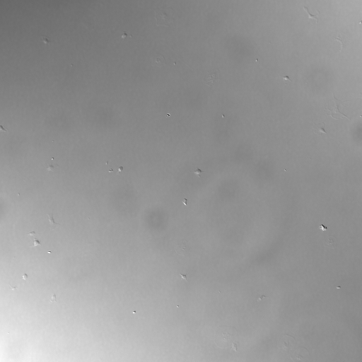</td>
<td>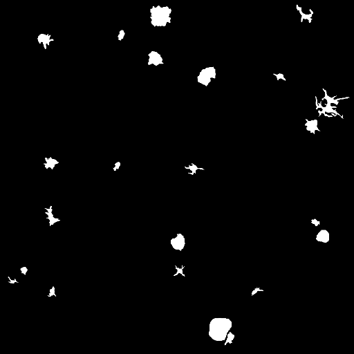</td>
<td></td>
</tr>

<tr>
<td>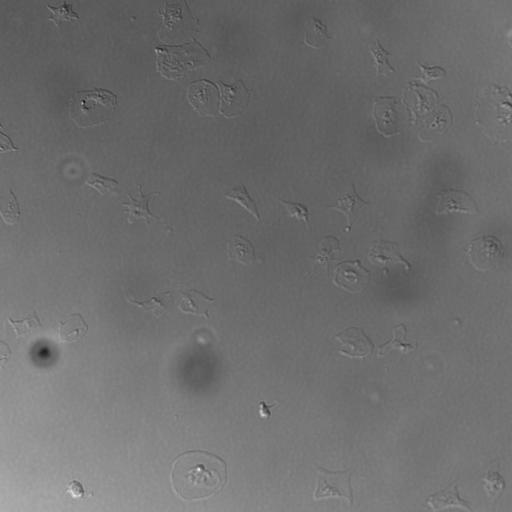</td>
<td></td>
<td>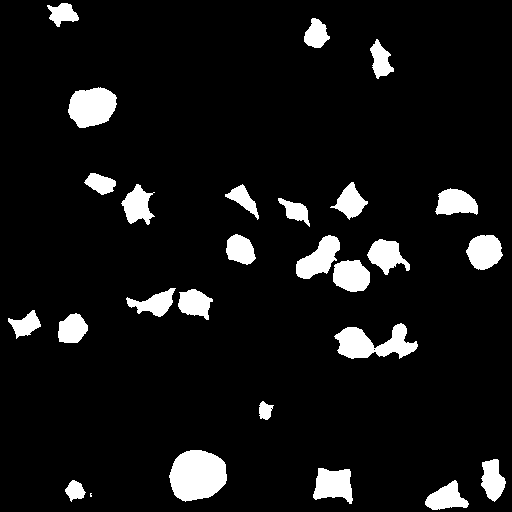</td>
</tr>

<tr>
<td>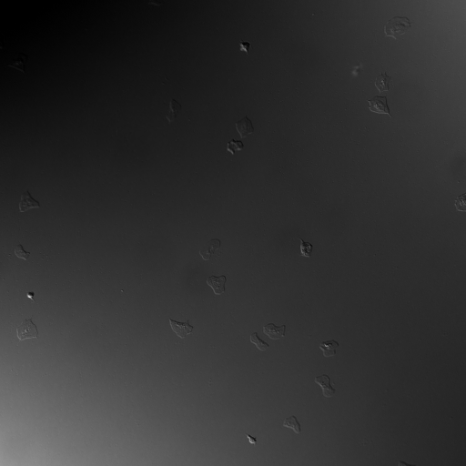</td>
<td>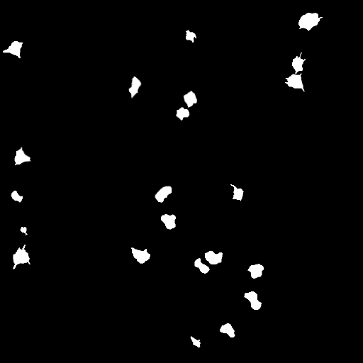</td>
<td>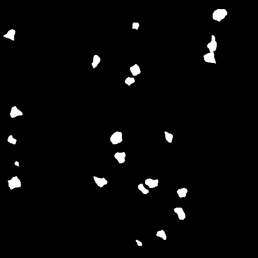</td>
</tr>

<tr>
<td></td>
<td></td>
<td></td>
</tr>

<tr>
<td>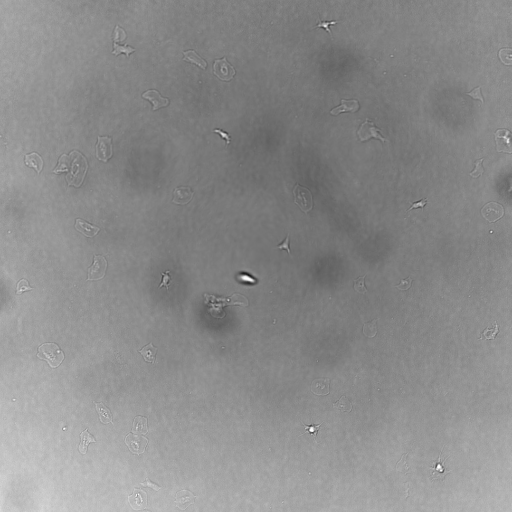</td>
<td>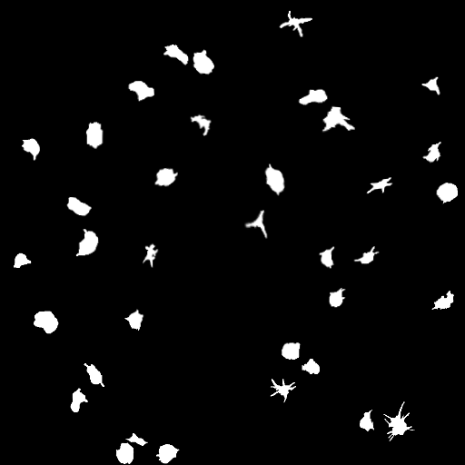</td>
<td>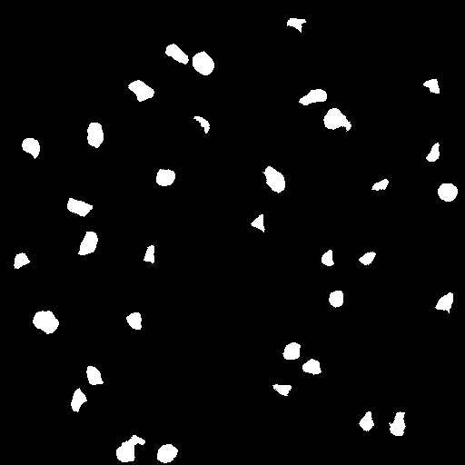</td>
</tr>

<tr>
<td>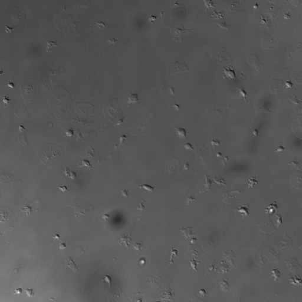</td>
<td>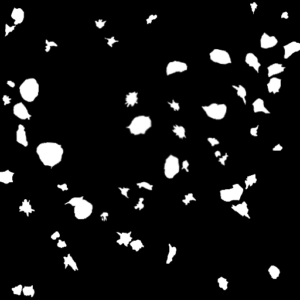</td>
<td>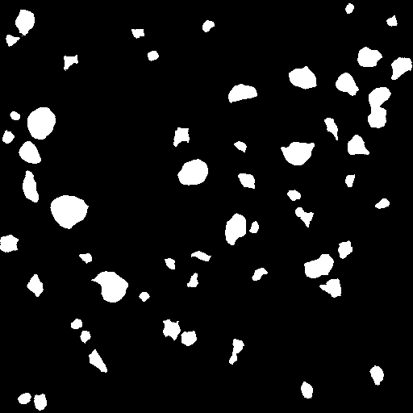</td>
</tr>
</table>

 
<h3>
References
</h3>
<b>1. Multi-stream Cell Segmentation with Low-level Cues for Multi-modality Images</b> 
Wei Lou, Xinyi Yu, Chenyu Liu , Xiang Wan, Guanbin Li, Siqi Liu, Haofeng Li 
<a href="https://arxiv.org/pdf/2310.14226">https://arxiv.org/pdf/2310.14226</a>
 
 

<b>2. MEDIAR: Harmony of Data-Centric and Model-Centric for Multi-Modality Microscopy
</b> 
Lee-Gihun  
<a href="https://github.com/Lee-Gihun/MEDIAR">https://github.com/Lee-Gihun/MEDIAR</a>
 
 
<b>3. NeurIPS-CellSeg
</b> 
JunMa11  
<a href="https://github.com/JunMa11/NeurIPS-CellSeg">https://github.com/JunMa11/NeurIPS-CellSeg</a>
 
 
<b>4. Tensorflow-Tiled-Image-Segmentation-Augmented-NeurIPS-DIC-Weak-Boundary
</b> 
Toshiyuki Arai @antillia.com 
<a href="https://github.com/sarah-antillia/Tensorflow-Tiled-Image-Segmentation-Augmented-NeurIPS-DIC-Weak-Boundary">
https://github.com/sarah-antillia/Tensorflow-Tiled-Image-Segmentation-Augmented-NeurIPS-DIC-Weak-Boundary</a>
 
 
<b>5. Fundamental Concepts in DIC Microscopy
</b> 
<a href="https://www.olympus-lifescience.com/en/microscope-resource/primer/techniques/dic/dicintro/">
https://www.olympus-lifescience.com/en/microscope-resource/primer/techniques/dic/dicintro/
</a>
 

